  

# 👨‍💻 Hey there, I'm **Nishkal**

  

---

## 🚀 **About Me**
- MERN Stack Developer  
- Algorithm & System Design enthusiast  
- Passionate about building scalable full-stack apps  
- I love creating elegant, efficient, and user-friendly digital products  

---

## 🛠️ **Tech Stack**

  

---

## 📊 **GitHub Stats**

  
  

  

---

## 🌀 **Activity Graph**

  

---

## 🐍 **Contribution Snake**

  

---

  

---

## 🔗 **Connect With Me**

  
  
  

